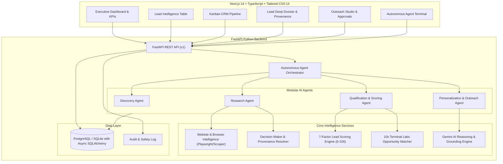

# Terminal Labs - AI Lead Generation & Qualification Platform
## Architecture & Implementation Blueprint

### 1. System Overview
The **Terminal Labs Lead Intelligence Platform** is an autonomous B2B engine engineered to discover, inspect, qualify, score, and draft hyper-personalized outreach for prospective clients matching Terminal Labs' 10 core service offerings:
1. AI Agents
2. AI Automation
3. WhatsApp Automation
4. SaaS Development
5. Web Application Development
6. Mobile App Development
7. Data Analytics
8. DevOps / Cloud
9. UI/UX Modernization
10. Custom Software

---

### 2. Architectural Blueprint

---

### 3. Core Lead Scoring Framework (0 - 100)
The scoring algorithm computes weighted indices across 7 verified vectors:
- **Business Fit (15%)**: Industry alignment, revenue tier, team size.
- **Service Fit (20%)**: Direct match with Terminal Labs' 10 service verticals.
- **Pain Signal (20%)**: Friction in current stack, outdated UI, missing automation.
- **Buying Signal (15%)**: Active hiring, recent funding, tech migration, expansion.
- **Company Fit (10%)**: Digital maturity, scale, budget viability.
- **Digital Opportunity (10%)**: Absence of chatbot, lacking WhatsApp flow, legacy web stack.
- **Contactability (10%)**: Verified decision makers identified with source URLs.

---

### 4. Implementation Strategy
1. **Backend Core & Database Models**: SQLAlchemy models, Pydantic schemas, database engine with zero-config SQLite & PostgreSQL support.
2. **Intelligence Services & Agents**:
   - Discovery Engine with multi-criteria filtering
   - Website Intelligence & Browser Inspector (Playwright-capable with graceful fallback parser)
   - Decision Maker Finder with legitimate public provenance tracking
   - 7-Factor Lead Scoring Engine
   - 10-Service Opportunity Matcher
   - Grounded Outreach Generator (Cold Email, LinkedIn, Follow-up, Icebreaker Hook)
   - Autonomous Pipeline Orchestrator (Discovery -> Research -> Qualification -> Personalization)
3. **Demo Seed Data**: Comprehensive high-fidelity B2B sample leads across diverse sectors (E-commerce, Healthcare, Logistics, Legal, FinTech, SaaS, Real Estate).
4. **FastAPI Endpoints**: Full CRUD, agent control, pipeline kanban, statistics, provenance viewer, outreach approvals.
5. **Next.js 14 Frontend**:
   - High-density dark cyberpunk/enterprise design system
   - Real-time Autonomous Agent Terminal with live logs
   - Deep Lead Detail Drawer with Facts vs. Inferences viewer
   - Interactive Outreach Studio with one-click copy and approval toggles
   - Dynamic Pipeline Kanban with stage transitions
   - Analytics Dashboard with interactive charts
6. **Testing & Validation**: Unit tests for scoring, duplication, provenance, opportunity matching, and API endpoints.
7. **End-to-End Verification**: Browser verification using browser subagent.
