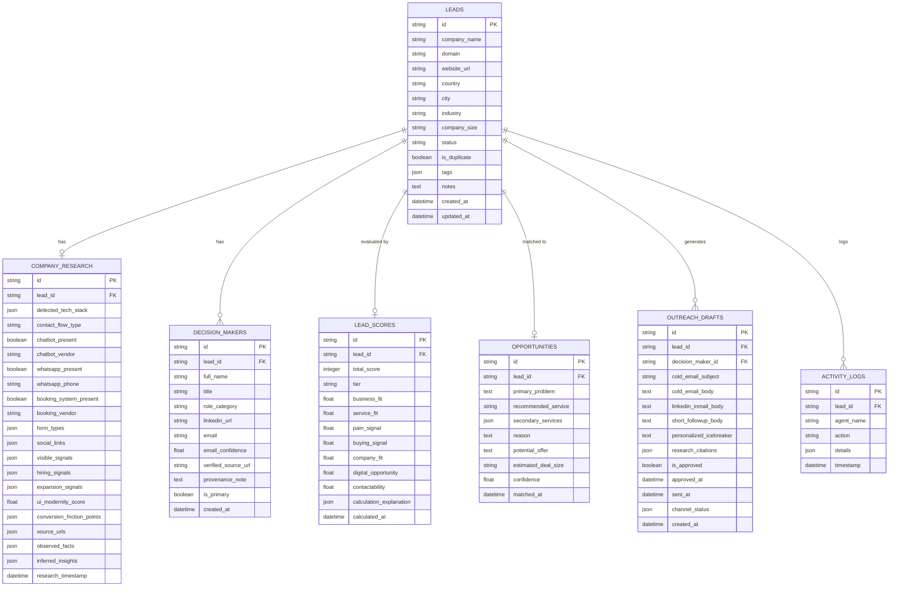

# Terminal Labs Database Schema Specification

The Terminal Labs Lead Intelligence Platform uses an async relational schema supported on both **PostgreSQL** and **SQLite** via SQLAlchemy 2.0.

```mermaid
erDiagram
    LEADS ||--o| COMPANY_RESEARCH : "has"
    LEADS ||--o{ DECISION_MAKERS : "has"
    LEADS ||--o| LEAD_SCORES : "evaluated by"
    LEADS ||--o| OPPORTUNITIES : "matched to"
    LEADS ||--o{ OUTREACH_DRAFTS : "generates"
    LEADS ||--o{ ACTIVITY_LOGS : "logs"

    LEADS {
        string id PK
        string company_name
        string domain
        string website_url
        string country
        string city
        string industry
        string company_size
        string status
        boolean is_duplicate
        json tags
        text notes
        datetime created_at
        datetime updated_at
    }

    COMPANY_RESEARCH {
        string id PK
        string lead_id FK
        json detected_tech_stack
        string contact_flow_type
        boolean chatbot_present
        string chatbot_vendor
        boolean whatsapp_present
        string whatsapp_phone
        boolean booking_system_present
        string booking_vendor
        json form_types
        json social_links
        json visible_signals
        json hiring_signals
        json expansion_signals
        float ui_modernity_score
        json conversion_friction_points
        json source_urls
        json observed_facts
        json inferred_insights
        datetime research_timestamp
    }

    DECISION_MAKERS {
        string id PK
        string lead_id FK
        string full_name
        string title
        string role_category
        string linkedin_url
        string email
        float email_confidence
        string verified_source_url
        text provenance_note
        boolean is_primary
        datetime created_at
    }

    LEAD_SCORES {
        string id PK
        string lead_id FK
        integer total_score
        string tier
        float business_fit
        float service_fit
        float pain_signal
        float buying_signal
        float company_fit
        float digital_opportunity
        float contactability
        json calculation_explanation
        datetime calculated_at
    }

    OPPORTUNITIES {
        string id PK
        string lead_id FK
        text primary_problem
        string recommended_service
        json secondary_services
        text reason
        text potential_offer
        string estimated_deal_size
        float confidence
        datetime matched_at
    }

    OUTREACH_DRAFTS {
        string id PK
        string lead_id FK
        string decision_maker_id FK
        string cold_email_subject
        text cold_email_body
        text linkedin_inmail_body
        text short_followup_body
        text personalized_icebreaker
        json research_citations
        boolean is_approved
        datetime approved_at
        datetime sent_at
        json channel_status
        datetime created_at
    }

    ACTIVITY_LOGS {
        string id PK
        string lead_id FK
        string agent_name
        string action
        json details
        datetime timestamp
    }
```
